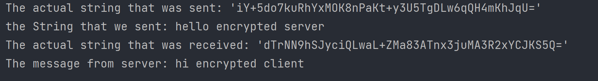
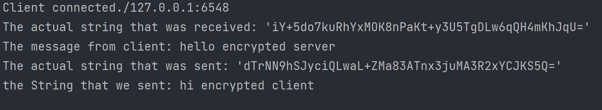
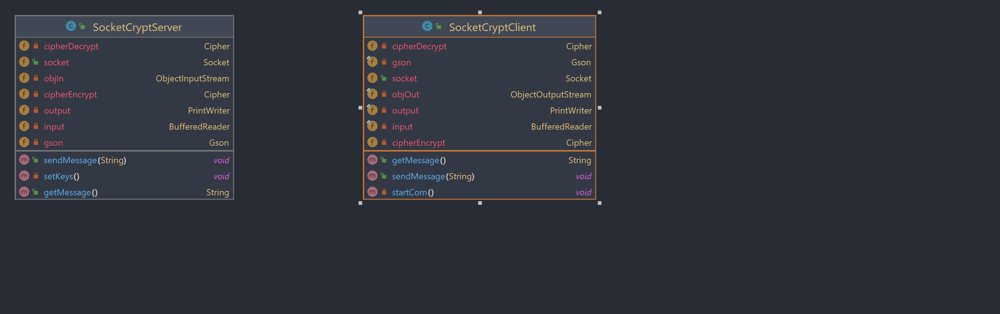

# SocketCrypt

<div align="center">

</div>

SocketCrypt is a comprehensive Java library designed to facilitate secure communication over sockets. It provides a set of classes that enable developers to encrypt and decrypt data transmitted over these sockets. The library leverages the robust security of the RSA algorithm for secure key exchange, ensuring that the keys used for data encryption and decryption are securely exchanged between the communicating parties.

For the actual data encryption and decryption, SocketCrypt employs the Advanced Encryption Standard (AES). AES is a symmetric encryption algorithm that is widely recognized for its high level of security. It is used to encrypt the data before it is sent over the socket, and then decrypt it upon receipt. This ensures that even if the data is intercepted during transmission, it remains unreadable without the correct decryption key.

In essence, SocketCrypt is a powerful tool for developers looking to implement secure socket communication in their Java applications. It provides a simple and effective solution for encrypting and decrypting data, making it easier to build secure network applications.


<div align="center">
<h2>client:</h2>


<h2>server:</h2>

</div>

## Features
- Secure communication over sockets
- RSA key exchange for secure communication
- AES data encryption
## Installation
To use SocketCrypt in your project, add the following to your pom.xml file:
```

```
## Usage
### SocketCryptClient
The `SocketCryptClient` class extends the `Socket` class and provides methods for sending and receiving encrypted messages.

```java
public class Main {
    public static void main(String[] args) throws IOException {
        SocketCryptClient s = new SocketCryptClient("localhost",6548);
        s.sendMessage("hello encrypted server");
        s.getMessage();
    }
}
```
### SocketCryptServer
The `SocketCryptServer` class provides methods for sending and receiving encrypted messages.
```java
public class MainServer {

    public static void main(String[] args) throws IOException {
        try (ServerSocket serverSocket = new ServerSocket(6548)) {
            Socket clientSocket = serverSocket.accept();
            SocketCryptServer s = new SocketCryptServer(clientSocket);
            System.out.println("Client connected." + clientSocket.getLocalSocketAddress());
            s.getMessage();
            s.sendMessage("hi encrypted client");
        } catch (Exception e) {
            e.printStackTrace();
        }
    }

}
```
### UML

## Contributing
Contributions are welcome! Please feel free to submit a pull request.

## License
SocketCrypt is released under the MIT License. See the [LICENSE](license) file for more details.